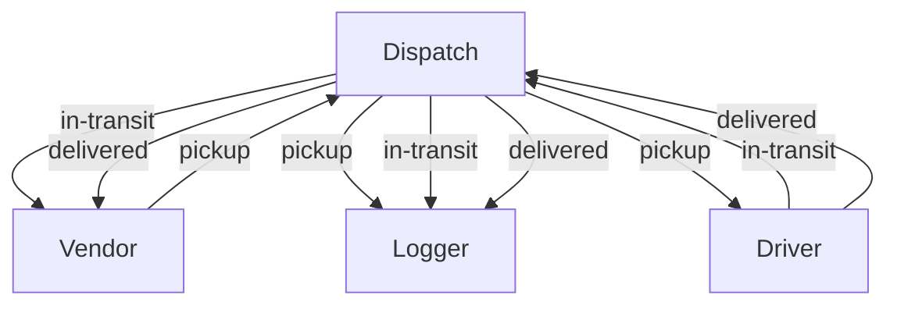
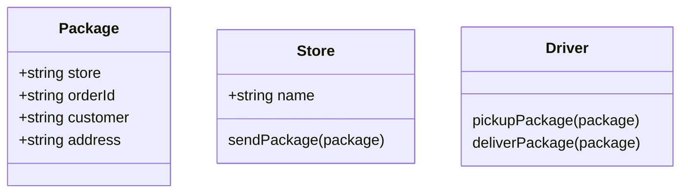
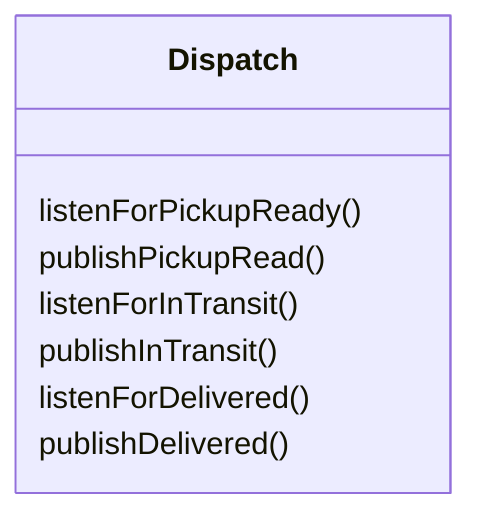

# Delivery Driver Simulator

This little program simulates a deliver dispatch system. It uses node eventHandler to dispatch events between the parties.

## Diagram



## Requirements

The following user/developer stories detail the major functionality for this simulation.

- As a vendor, I want to alert the system when I have a package to be picked up.
- As a driver, I want to be notified when there is a package to be delivered.
- As a driver, I want to alert the system when I have picked up a package and it is in transit.
- As a driver, I want to alert the system when a package has been delivered.
- As a vendor, I want to be notified when my package has been delivered.

## Data Objects

```
 store = {
   "store": "<store-name>",
   "orderId": "<unique-order-id>",
   "customer": "<customer-name>",
   "address": "<city-state>"
 }
```

```
event = { event: 'pickup',
  time: 2020-03-06T18:27:17.732Z,
  payload:
   { store: '1-206-flowers',
     orderID: 'e3669048-7313-427b-b6cc-74010ca1f8f0',
     customer: 'Jamal Braun',
     address: 'Schmittfort, LA' } }
```

example of event logging:

```
EVENT { event: 'pickup',
  time: 2020-03-06T18:27:17.732Z,
  payload:
   { store: '1-206-flowers',
     orderID: 'e3669048-7313-427b-b6cc-74010ca1f8f0',
     customer: 'Jamal Braun',
     address: 'Schmittfort, LA' } }
DRIVER: picked up e3669048-7313-427b-b6cc-74010ca1f8f0
EVENT { event: 'in-transit',
  time: 2020-03-06T18:27:18.738Z,
  payload:
   { store: '1-206-flowers',
     orderID: 'e3669048-7313-427b-b6cc-74010ca1f8f0',
     customer: 'Jamal Braun',
     address: 'Schmittfort, LA' } }
DRIVER: delivered up e3669048-7313-427b-b6cc-74010ca1f8f0
VENDOR: Thank you for delivering e3669048-7313-427b-b6cc-74010ca1f8f0
EVENT { event: 'delivered',
  time: 2020-03-06T18:27:20.736Z,
  payload:
   { store: '1-206-flowers',
     orderID: 'e3669048-7313-427b-b6cc-74010ca1f8f0',
     customer: 'Jamal Braun',
     address: 'Schmittfort, LA' } }
```




